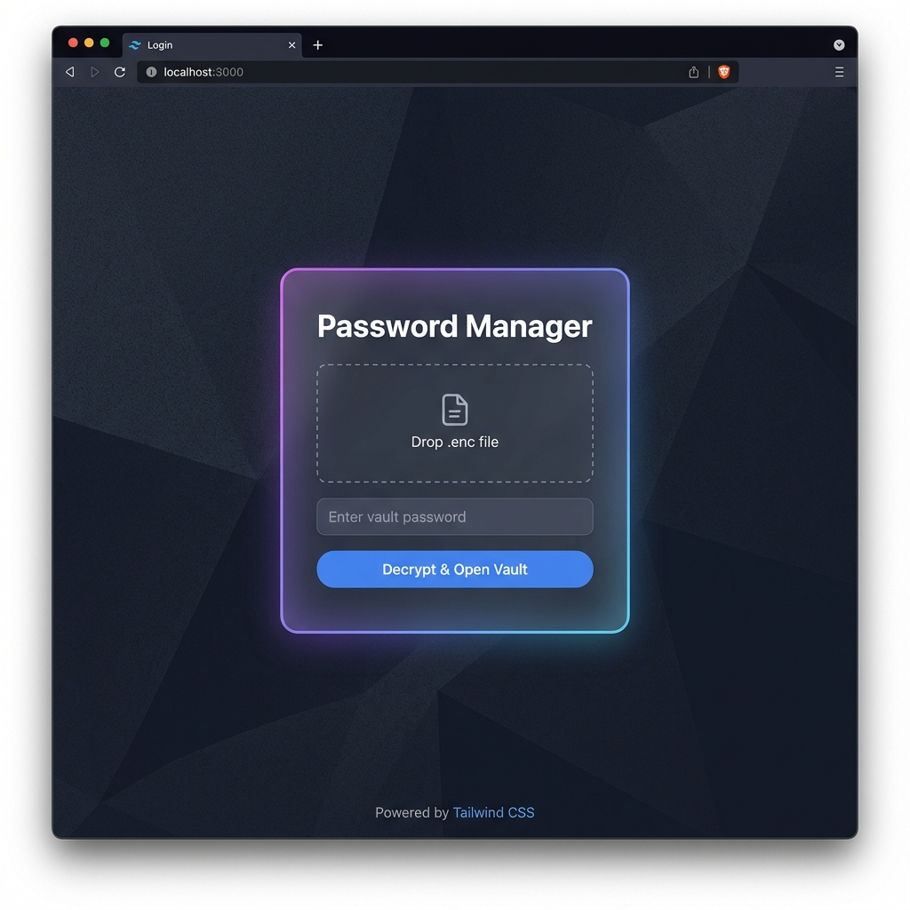
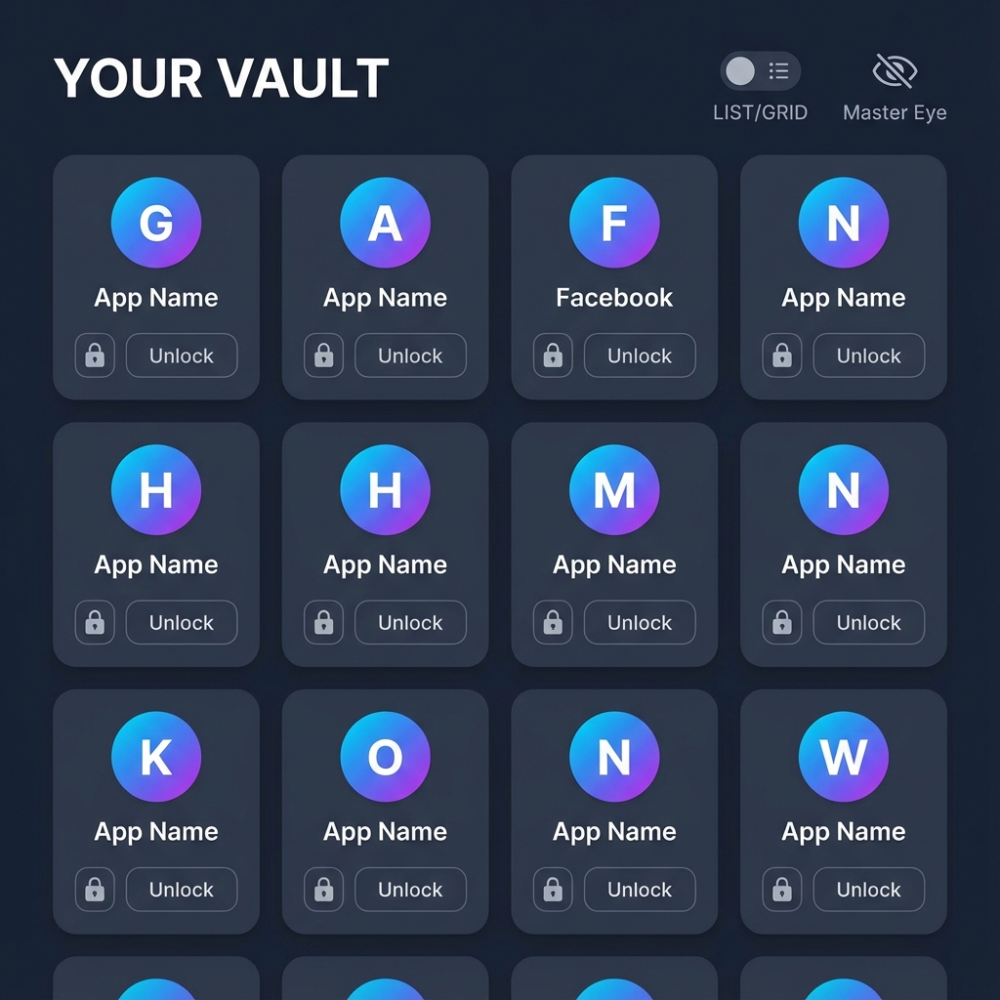
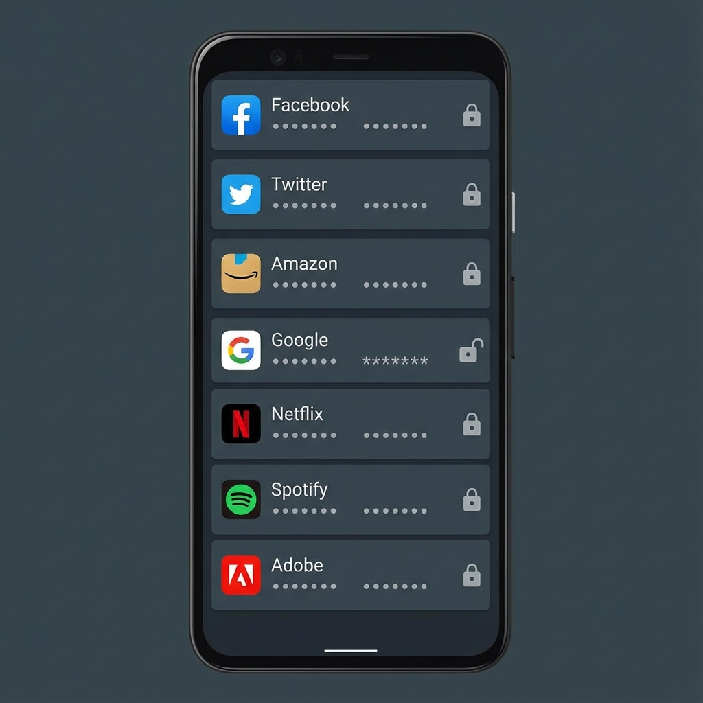

# Password Manager Web

A secure, web-based companion for the Android Password Manager application. This application allows you to view your encrypted vault data directly in the browser with a focus on security and privacy.

## 🔒 Security Architecture
- **Client-Side Decryption**: Your data is decrypted locally in your browser using the **Web Crypto API**. Plaintext credentials never touch a server.
- **AES-GCM Encryption**: Compatible with the Android app's export format, using AES-GCM encryption and PBKDF2 key derivation.
- **Zero-Persistence**: Decrypted data exists only in the volatile memory of the current page session. Reloading the page clears all data.

---

## 📸 Functionality Walkthrough

### 1. Secure Login & Import
Start by dragging and dropping your encrypted `.enc` file (exported from the Android app) into the drop zone. Enter your **Encrypt Password** to securely decrypt and load your vault into memory.



### 2. Vault View (Locked State)
Once imported, your vault items are displayed. By default, **all items are LOCKED** for security. You can toggle between **Grid View** (cards) and **List View** (compact rows) using the toggle in the toolbar.

**Grid View:**


**List View:**


### 3. Unlocking & Viewing Credentials
To view a password, click the **Unlock** button on any item. You will be prompted to re-enter your master password.
- **Masking**: Even after unlocking, credentials remain masked (`••••••`) by default to prevent shoulder surfing.
- **Reveal**: Click the "Eye" icon next to any specific field to reveal the plaintext.
- **Re-Lock**: Click the "Lock" icon to immediately secure the item again.


### 4. Global Visibility
Use the **Master Eye Icon** in the top toolbar to globally reveal or hide credentials for all currently *unlocked* items. This is useful for quickly managing visibility during a session.

---

## 🛠️ Tech Stack
- **Framework**: [React](https://react.dev/) + [Vite](https://vitejs.dev/)
- **Language**: [TypeScript](https://www.typescriptlang.org/)
- **Styling**: [Tailwind CSS](https://tailwindcss.com/)
- **Cryptography**: Native [Web Crypto API](https://developer.mozilla.org/en-US/docs/Web/API/Web_Crypto_API)

## 🚀 Getting Started

1.  **Clone the repository**
    ```bash
    git clone https://github.com/AndroPlus/password-manager-web.git
    cd password-manager-web
    ```

2.  **Install Dependencies**
    ```bash
    npm install
    ```

3.  **Run Development Server**
    ```bash
    npm run dev
    ```

## ⚠️ Important Note
This is a viewer application. It currently supports **Read-Only** access to your exported vault. Editing or creating new credentials should be done via the primary Android application.
